# Contracting Company Web App

## Project Idea

This project is a simple frontend for a contracting company. It demonstrates a portfolio-style landing page with a demo link, an image gallery for project photos, and a company video which can be played or downloaded.

## Project Structure

- `index.html` - Main HTML page for the site.
- `styles.css` - Styles for layout and presentation.
- `scripts.js` - JavaScript for interactive behavior.
- `c1.jpg` .. `c12.jpg` - Project images, located next to `index.html`.
- `Company.mp4` - Company video file, located next to `index.html`.

> Note: Image files are referenced as `./c1.jpg` through `./c12.jpg`, and the video as `./Company.mp4` (paths are relative to `index.html`).

## Demo

Live demo: https://contracting-company-app.vercel.app/

Open the demo link in your browser to see the deployed version.

## Image Gallery (c1 — c12)

The gallery below displays images `c1` through `c12` using relative paths. If your images have a different extension (for example `.png`), update the filenames accordingly.

### Screenshot 1: Main Interface
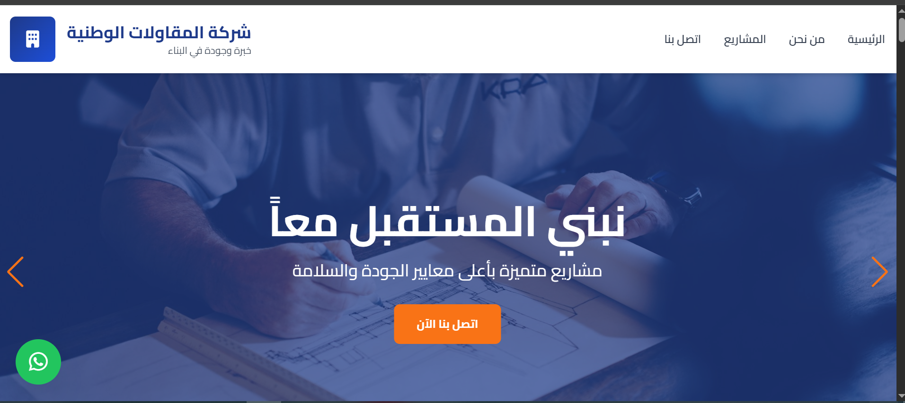
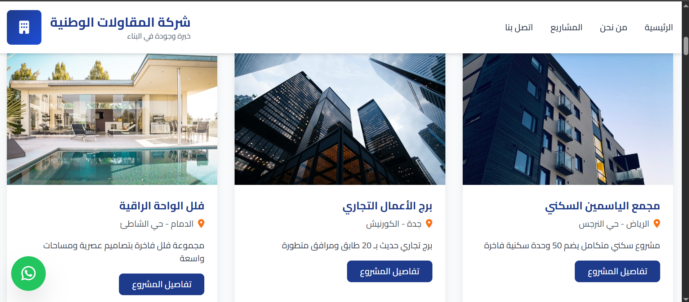
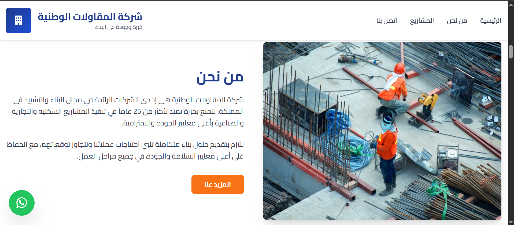
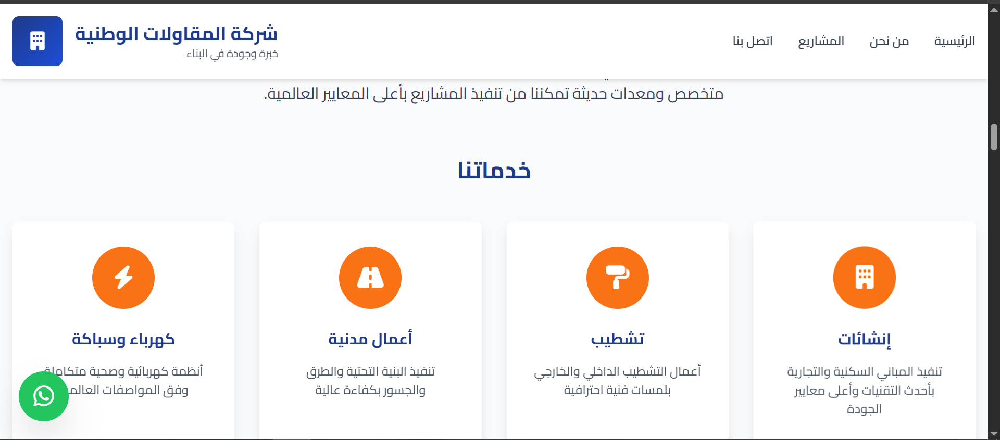
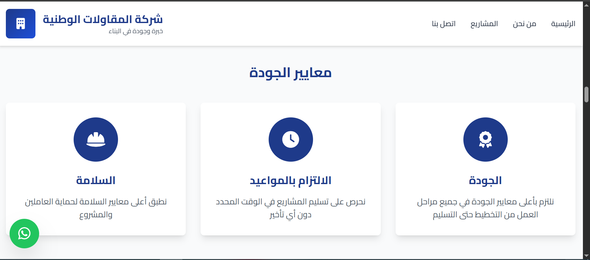
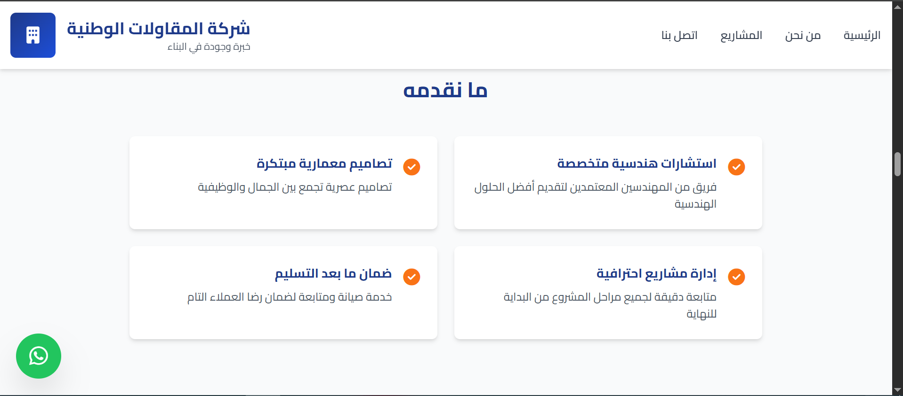
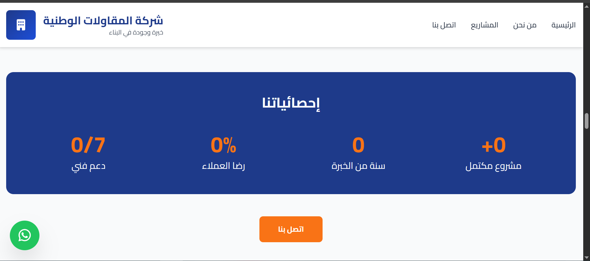
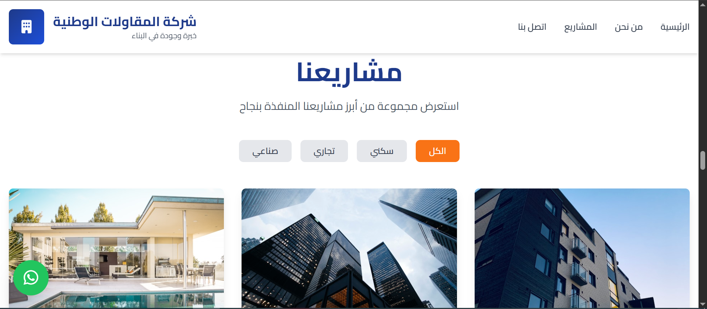
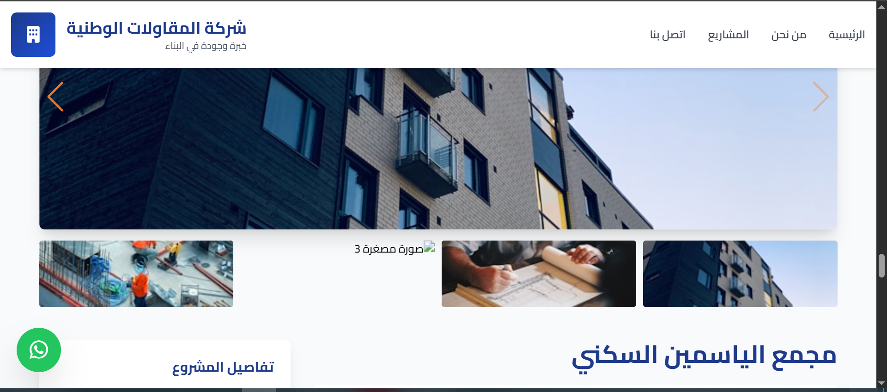
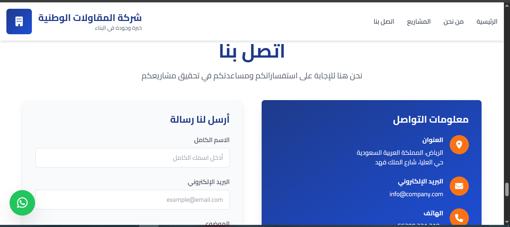
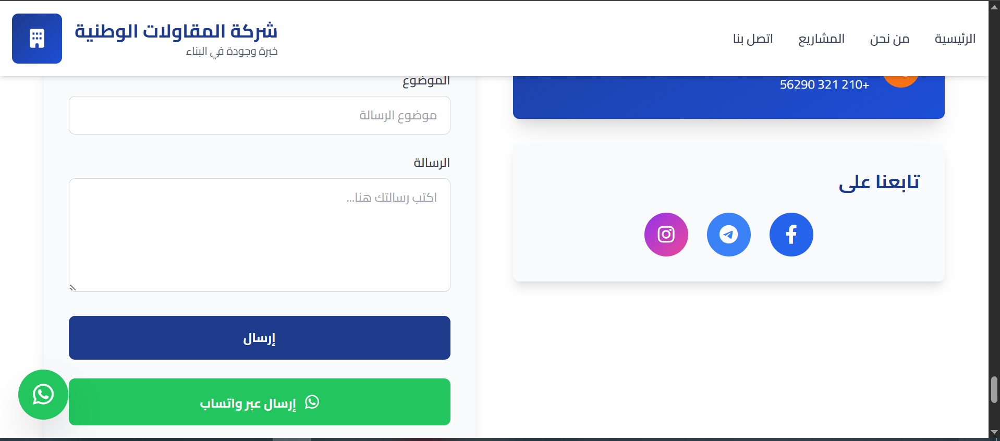
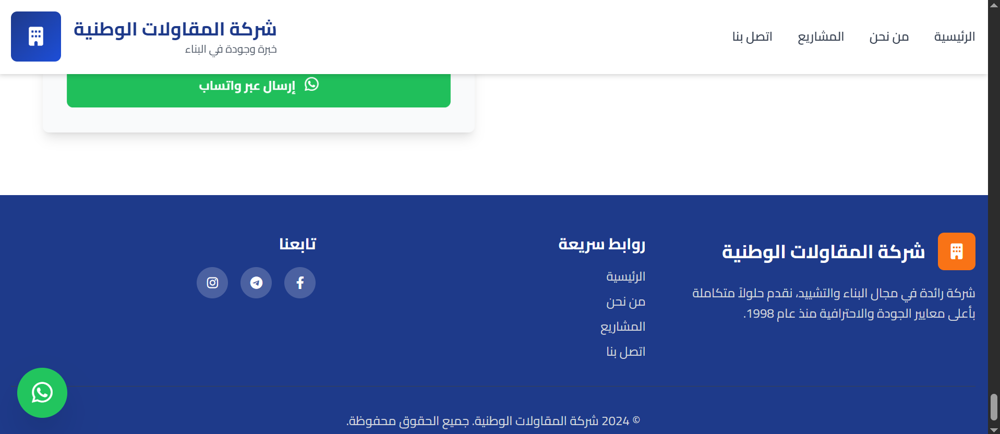
If the images do not appear, confirm that the files `c1.jpg` .. `c12.jpg` exist in the same folder as `index.html`.

## Company Video

You can play the company video directly or download it using the links below.

HTML5 player (relative path):

<video controls width="640" src="Company.mp4">
  Your browser does not support the video tag.
</video>

[Download Company.mp4](Company.mp4)

## Portfolio Note

This video is also uploaded directly to the portfolio at:

https://mohamed-abdelmajeed-portfolio.vercel.app/

The video file (`Company.mp4`) is hosted/linked on that portfolio directly.

## How to View Locally

1. Ensure the following files are in the same folder: `index.html`, `styles.css`, `scripts.js`, `c1.jpg`..`c12.jpg`, `Company.mp4`.
2. Open `index.html` in your browser (double-click or serve with a local static server).

If you need changes (different image extensions, smaller thumbnails, or gallery layout examples), tell me which format you prefer and I will update the README and sample markup.
